| ALPHA |
| --- |
|  |

| AUTUMN |
| --- |
|  |

| BATHYMETRY |
| --- |
| 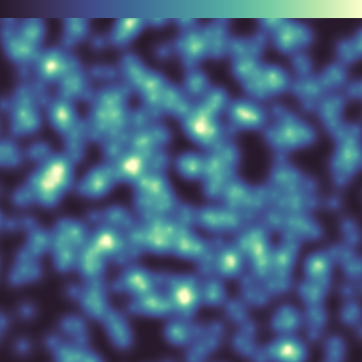 |

| BLACKBODY |
| --- |
| 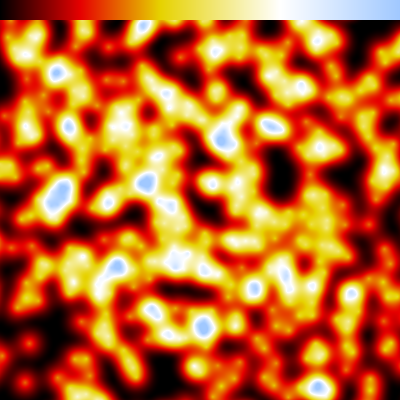 |

| BLUERED |
| --- |
|  |

| BONE |
| --- |
| 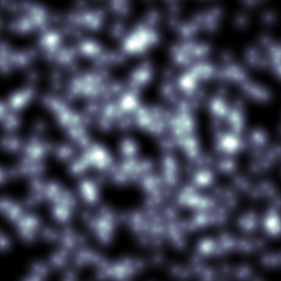 |

| CDOM |
| --- |
|  |

| CHLOROPHYLL |
| --- |
| 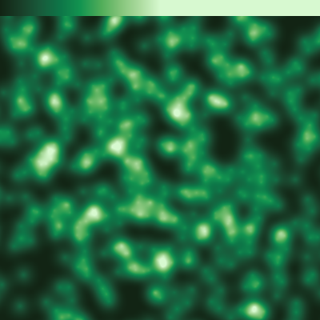 |

| COLD |
| --- |
| 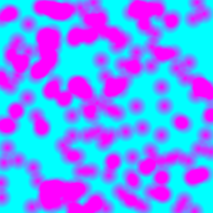 |

| COOL |
| --- |
| 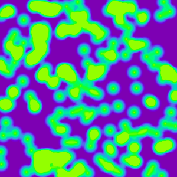 |

| COPPER |
| --- |
| 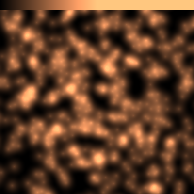 |

| CUBEHELIX |
| --- |
| 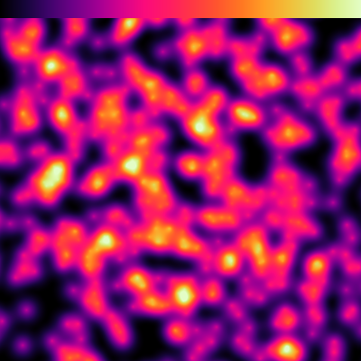 |

| DENSITY |
| --- |
|  |

| EARTH |
| --- |
| 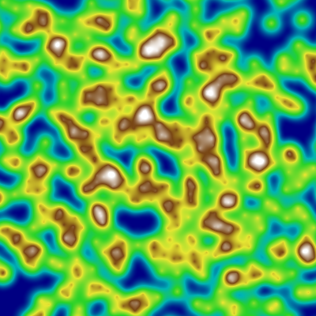 |

| ELECTRIC |
| --- |
| 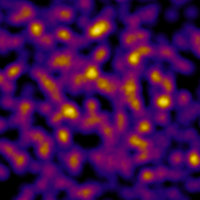 |

| FIVE_COLORS |
| --- |
| 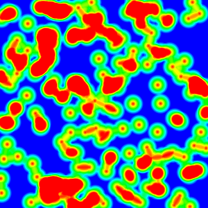 |

| FREESURFACE_BLUE |
| --- |
| 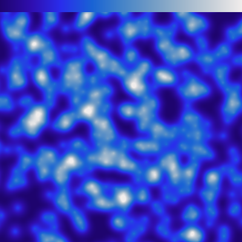 |

| FREESURFACE_RED |
| --- |
| 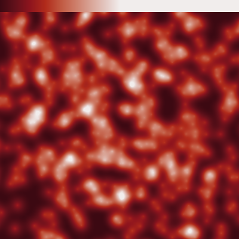 |

| GREENS |
| --- |
| 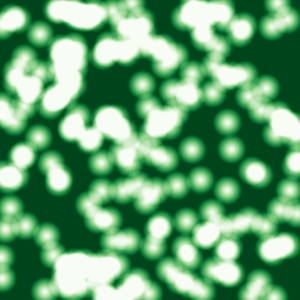 |

| GREYS |
| --- |
| 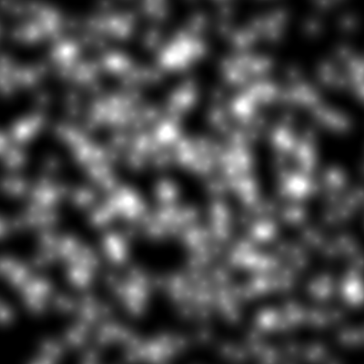 |

| HOT |
| --- |
| 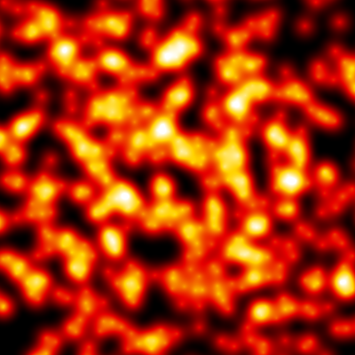 |

| HSV |
| --- |
| 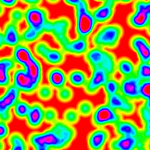 |

| INFERNO |
| --- |
| 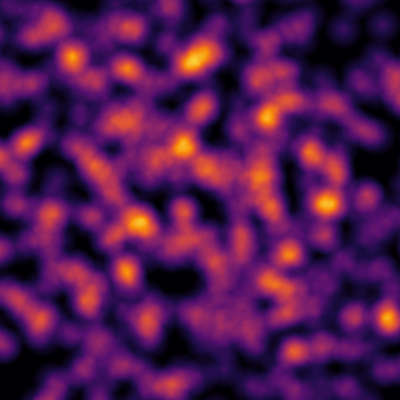 |

| JET |
| --- |
| 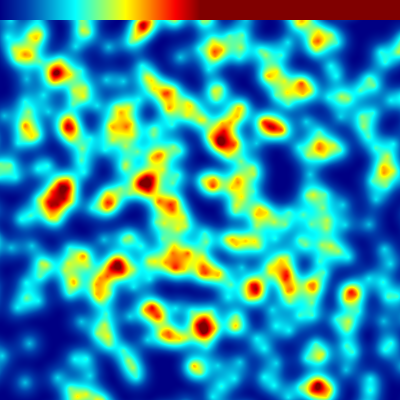 |

| MAGMA |
| --- |
| 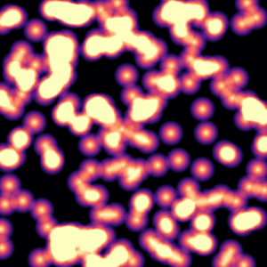 |

| MONOCHROME |
| --- |
|  |

| OXYGEN |
| --- |
| 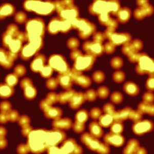 |

| PAR |
| --- |
| 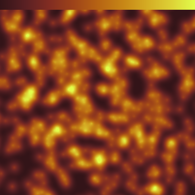 |

| PHASE |
| --- |
| 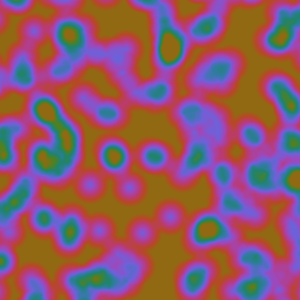 |

| PICNIC |
| --- |
| 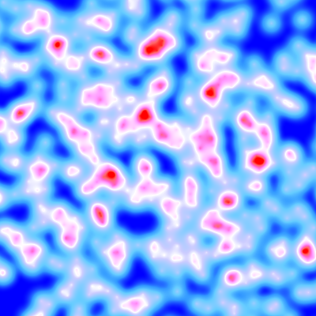 |

| PLASMA |
| --- |
|  |

| PORTLAND |
| --- |
| 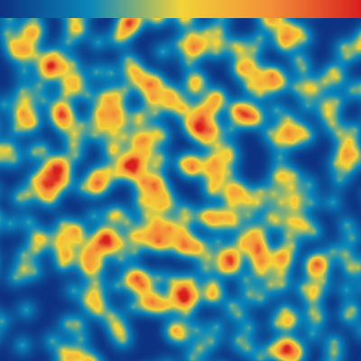 |

| RAINBOW |
| --- |
| 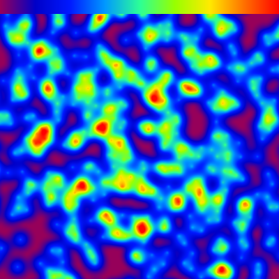 |

| RAINBOW_SOFT |
| --- |
|  |

| RDBU |
| --- |
| 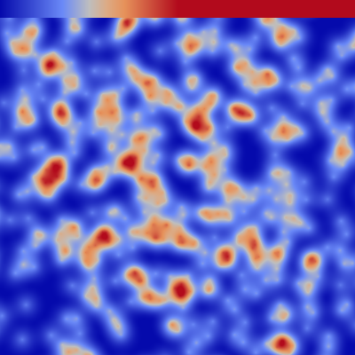 |

| SALINITY |
| --- |
| 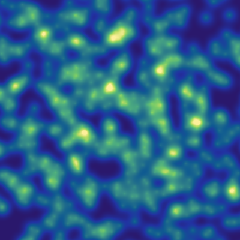 |

| SEVEN_COLORS |
| --- |
| 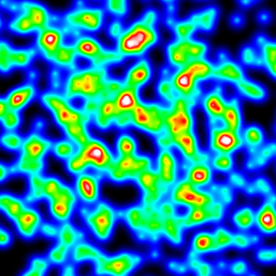 |

| SPRING |
| --- |
| 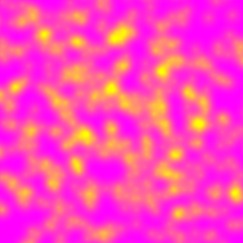 |

| SUMMER |
| --- |
| 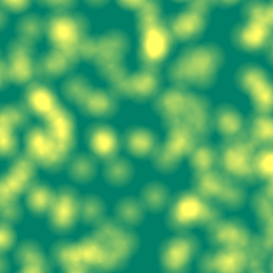 |

| TEMPERATURE |
| --- |
| 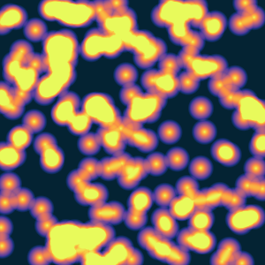 |

| TURBIDITY |
| --- |
| 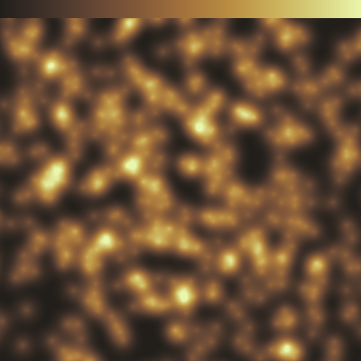 |

| VELOCITY_BLUE |
| --- |
| 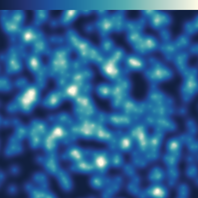 |

| VELOCITY_GREEN |
| --- |
| 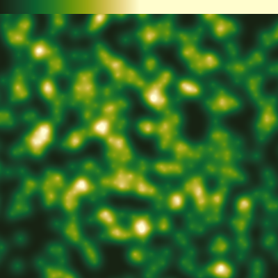 |

| VIRIDIS |
| --- |
| 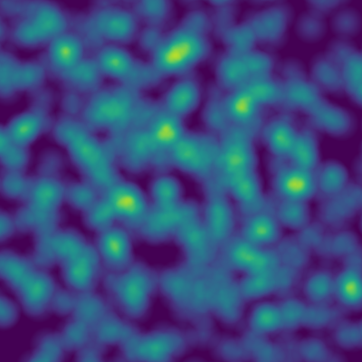 |

| WARM |
| --- |
| 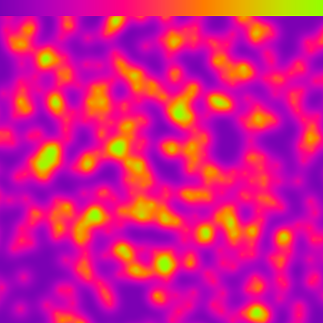 |

| WINTER |
| --- |
| 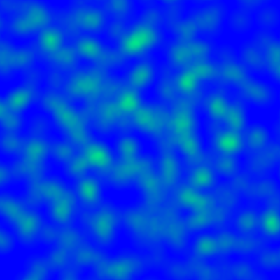 |

| YIGNBU |
| --- |
| 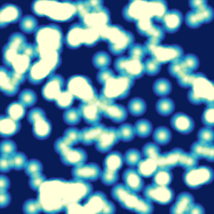 |

| YIORRD |
| --- |
| 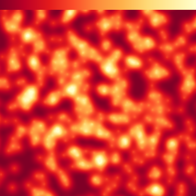 |

