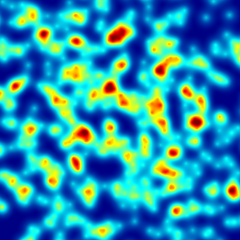

# heatmap
Simple heatmap image generator for Java.

* Renders heatmap images
* Double precision calculation
* 2 built in heat sources (Point and Segment)
* 48 built in color schemes
* 4 built in attenuation functions color and alpha (no attenuation, linear, quadratic, cubic)
* Custom heat sources
* Custom color schemes
* Custom attenuation functions

## Getting Started

```
double worldWidth = 800.0;
double worldHeight = 800.0;
int imageWidth = 400;
int imageHeight = 400;
double heatRadius = 50.0;
double maximumHeat = 0.3;

// random heat sources
Random random = new Random(1337);
List<HeatSource> heatSources = new ArrayList<>();
for (int i = 0; i < 1000; i++) {

	double x = (0.5 * random.nextGaussian() + 0.5) * worldWidth;
	double y = (0.5 * random.nextGaussian() + 0.5) * worldHeight;

	heatSources.add(new PointHeat(x, y, maximumHeat, heatRadius));
}

// heatmap
BinaryTreeHeatmap heatmap = new BinaryTreeHeatmap(heatSources);

// render image
HeatmapRenderer rendeder = new HeatmapRenderer(imageWidth, imageHeight);
rendeder.setBounds(new Bounds(0.0, 0.0, worldWidth, worldHeight));
ColorSchemes colorScheme = ColorSchemes.JET;
BufferedImage image = rendeder.render(heatmap, colorScheme);
```

 |

## Color Schemes

[Example images for color schemes](ColorShemes.md)


