# heatmap
Simple heatmap image generator for Java

**SEVEN_COLORS**

**FIVE_COLORS**

**MONOCHROME**

**JET**

**HSV**

**HOT**

**COLD**

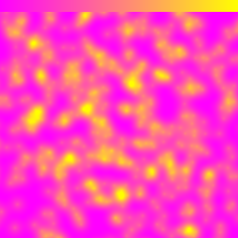
**SPRING**

**SUMMER**

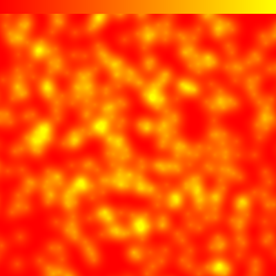
**AUTUMN**

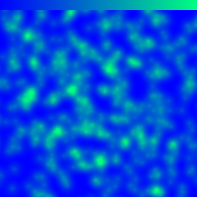
**WINTER**

**BONE**

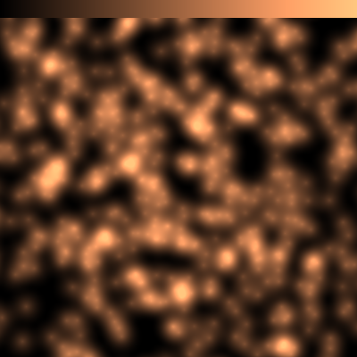
**COPPER**

**GREYS**

**YIGNBU**

**GREENS**

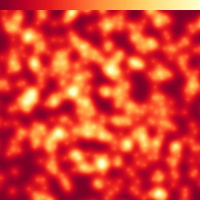
**YIORRD**

**BLUERED**

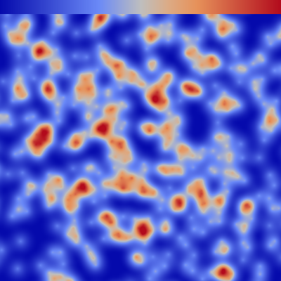
**RDBU**

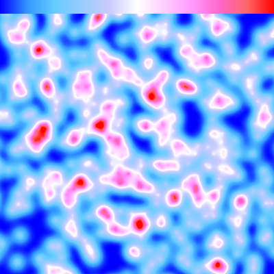
**PICNIC**

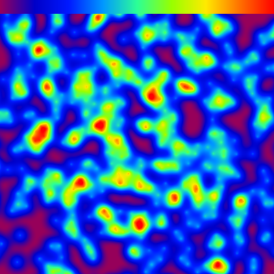
**RAINBOW**

**PORTLAND**

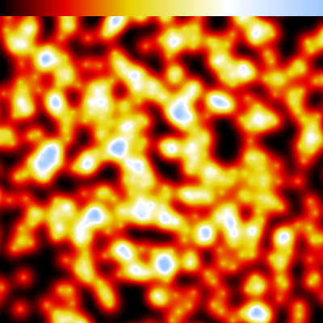
**BLACKBODY**

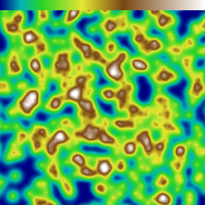
**EARTH**

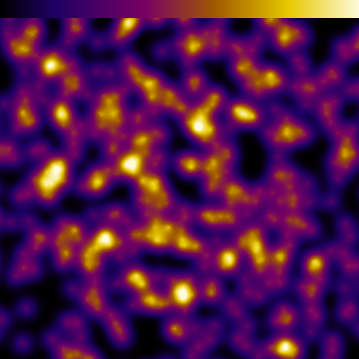
**ELECTRIC**

**ALPHA**

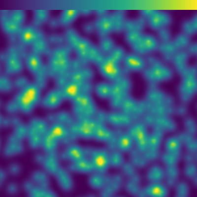
**VIRIDIS**

**INFERNO**

**MAGMA**

**PLASMA**

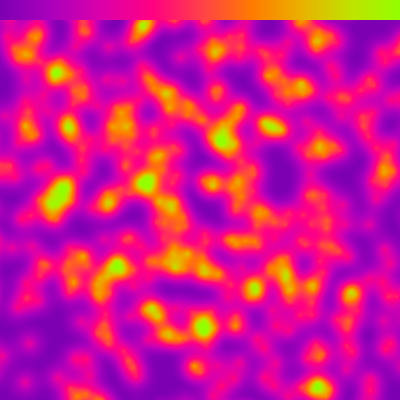
**WARM**

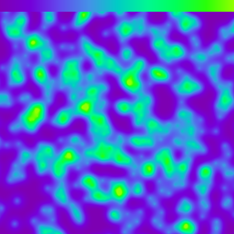
**COOL**

**RAINBOW_SOFT**

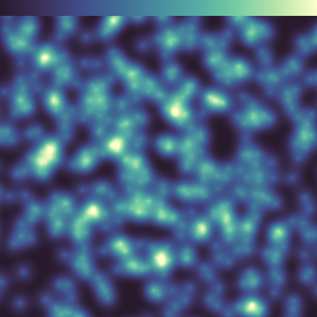
**BATHYMETRY**

**CDOM**

**CHLOROPHYLL**

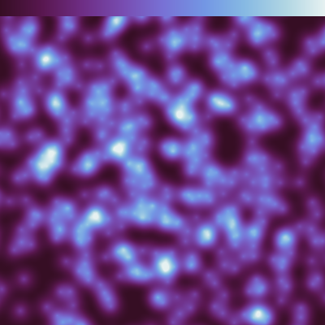
**DENSITY**

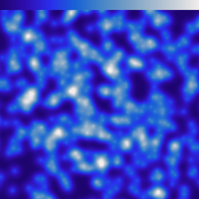
**FREESURFACE_BLUE**

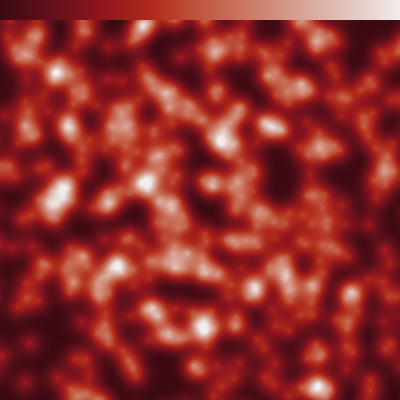
**FREESURFACE_RED**

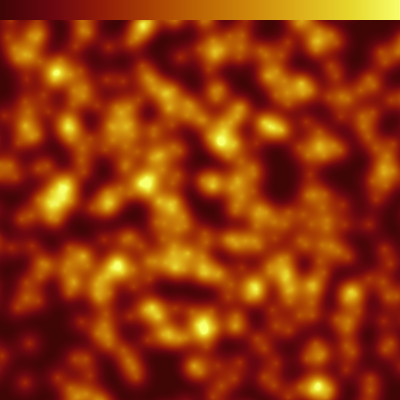
**OXYGEN**

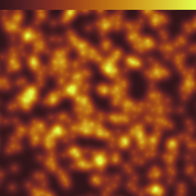
**PAR**

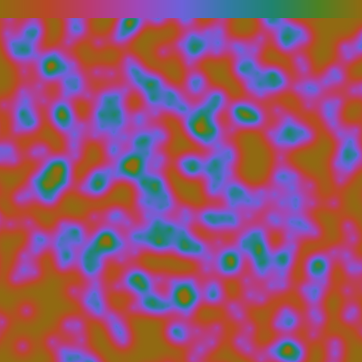
**PHASE**

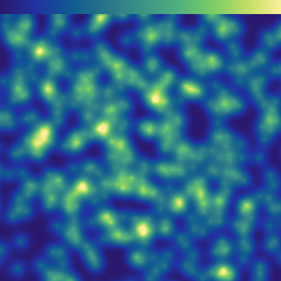
**SALINITY**

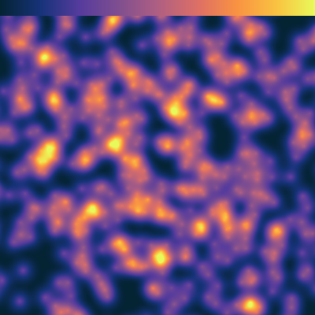
**TEMPERATURE**

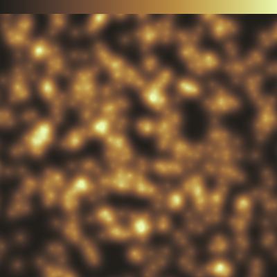
**TURBIDITY**

**VELOCITY_BLUE**

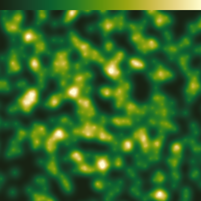
**VELOCITY_GREEN**

**CUBEHELIX**
